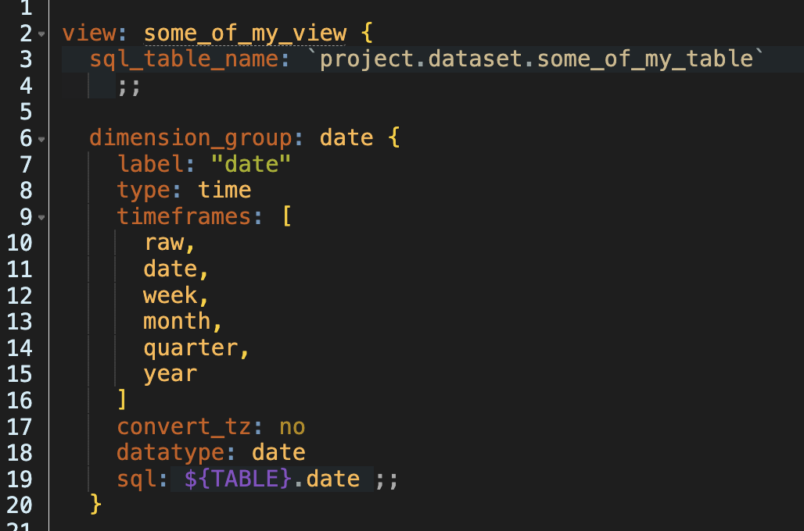

# looker-ide-like-gruvbox-dark-theme
like Gruvbox Dark theme for the Looker IDE (to be used with a CSS override add-on like Stylebot).

The LookML Editor is based on the open source [Ace editor](https://ace.c9.io/). While Ace has theme support, the themes does not work as-is in Looker. So I made a quick adaptation of the Solarized Dark theme for it to work using Stylebot.

## Dependencies
- A CSS override add-on, such as [Stylebot](https://chrome.google.com/webstore/detail/stylebot/oiaejidbmkiecgbjeifoejpgmdaleoha?hl=en) for Chrome.
- Either the Inconsolata or the Menlo font installed on your system (or customize the CSS to use your favorite coding font).

## Usage
Copy/paste the styles found in the file looker.css in Stylebot (or alternative add-on) and set the custom stylesheet for your Looker instance URL.

